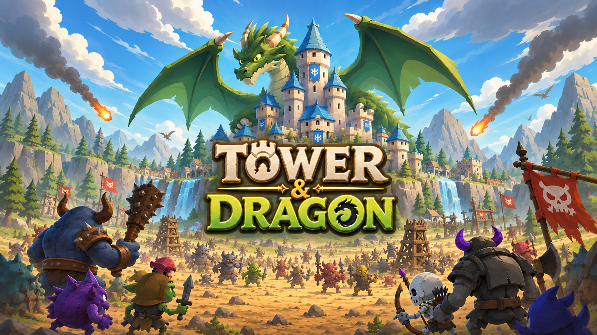
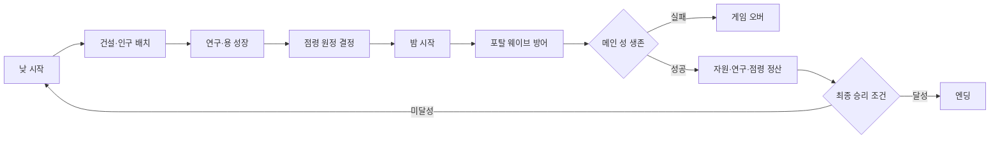
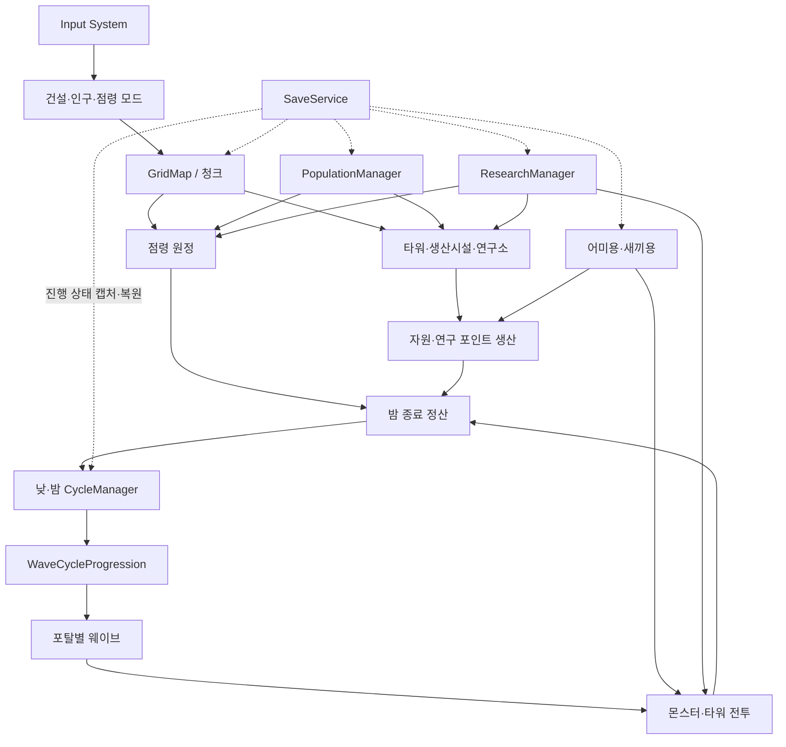

# Tower and Dragons

**낮의 선택이 밤의 생존을 결정하는 2D 아이소메트릭 타워디펜스 × 도시건설 게임**

## 프로젝트 소개

`Tower and Dragons`는 한정된 자원과 인구를 운용해 낮에는 도시를 확장하고, 밤에는 포탈에서 몰려오는 적으로부터 메인 성을 지키는 싱글플레이 전략 게임입니다.

플레이어는 생산·방어·연구·점령이 공유하는 인구를 어디에 배치할지 선택해야 합니다. 영토를 넓히면 새로운 자원과 성장 기회를 얻지만 적도 함께 강해지므로, **확장의 이득과 다음 밤의 위험을 동시에 계산하는 의사결정**이 핵심입니다. 여기에 어미용의 속성 운용, 새끼용 배치, 타워와 연구 빌드를 결합해 매 회차의 전략을 구성합니다.

| 항목 | 내용 |
| --- | --- |
| 장르 | 2D 아이소메트릭 타워디펜스 + 도시건설 |
| 개발 기간 | 2026.07 ~ 2026.09 |
| 개발 형태 | 기업협약 프로젝트 · 4인 팀 개발 |
| 플랫폼 | Windows / PC |
| 엔진 | Unity 6.3 (`6000.3.15f1`) |
| 핵심 키워드 | 용의 운용 · 인구의 배분 · 전략적 확장 |

## 프로젝트 안내

본 프로젝트는 4인 팀으로 제작한 타워디펜스·도시건설 게임입니다.

- 개발 기간:
- 개발 인원: 4명
- 담당 업무:
- Unity 버전: 6000.3.15f1

## 외부 에셋 안내

본 저장소는 포트폴리오 공개용입니다.
라이선스가 있는 외부 에셋은 저장소에 포함하지 않았으며,
따라서 저장소를 Clone한 상태만으로는 일부 그래픽·사운드·기능이
정상적으로 표시되지 않을 수 있습니다.

## 게임 플레이 흐름

- **낮 — 운영과 선택:** 타워·생산시설 건설, 인구 재배치, 연구, 점령 원정, 용 속성 변경을 진행합니다.
- **밤 — 실시간 방어:** 타워와 용 스킬로 여러 포탈의 웨이브를 막고 메인 성을 지킵니다.
- **정산 — 선택의 결과:** 생산 자원과 연구 포인트를 받고, 방어에 성공한 원정 지역을 점령합니다.
- **장기 목표:** 28일차 최종 보스를 격파하거나 네 포탈의 봉인 조건을 완성합니다.

## 주요 구현 내용

| 시스템 | 구현 내용 | 기술 포인트 |
| --- | --- | --- |
| **낮·밤 / 웨이브** | 일차 진행, 주기별 포탈 개방, 일반·보스 웨이브, 밤 종료 정산 연결 | `WaveCycleProgression`, `DailyWaveController`, ScriptableObject 일정 데이터 |
| **그리드 / 건설** | 아이소메트릭 타일 선택, 청크 단위 영토, 고스트 프리뷰, 회전·배치·철거 | Unity Tilemap, 셀 좌표 기반 배치 검증, 데이터 기반 건물 카탈로그 |
| **타워 / 전투** | 인구 충원율에 따른 가동, 속성·특수 타워, 사거리·투사체·상태이상 처리 | `TowerData` SO, 타깃 탐색, 공격·버프·상태효과 모듈화 |
| **인구 / 자원** | 생산·방어·연구·점령이 공유하는 인구 풀과 식량 유지비, 다음 날 생산량 예측 | `PopulationManager`, 용도별 Coordinator, 자원 노드·정산 규칙 분리 |
| **점령 / 확장** | 인접 지역 원정, 인구·자원 비용, 밤 방어 결과와 점령 판정, 확장 페널티 | `ConquestManager`, 청크 비용 데이터, 적 강화 Modifier 조합 |
| **용 / 연구** | 어미용 속성·액티브 스킬, 새끼용 성장·배치, 연구 트리와 효과 적용 | 효과별 ScriptableObject, 해금 조건, 전투·생산 Modifier 합성 |
| **몬스터 / 포탈** | 지상·공중·원거리·자폭·보호·마비 등 역할별 적과 포탈별 진격 경로 | 몬스터 데이터 분리, 상태효과, 일차·포탈별 스폰 구성 |
| **저장 / 편의 기능** | 진행도·건물·인구·연구·점령·용 상태 저장, 설정·키 리바인딩·미니맵·로컬라이징 | `SaveService` 캡처/복원 파이프라인, Input System, String Table |
| **튜토리얼 / UI** | 1~3일차 단계형 온보딩, 행동 제한과 목표 안내, 건설·점령·연구·용 UI | 튜토리얼 전용 씬, 이벤트 기반 UI 갱신, uGUI·TextMeshPro |

## 시스템 구조

시스템 간 직접 참조가 커지는 문제를 줄이기 위해 핵심 상태는 매니저가 관리하고, 생산·인구·전투 보정은 역할별 Coordinator와 Modifier가 연결합니다. 웨이브, 몬스터, 타워, 연구, 용 스킬과 밸런스 값은 ScriptableObject 및 CSV 데이터로 분리해 코드 수정 없이 조정할 수 있도록 구성했습니다.

## 기술 스택

| 구분 | 기술 | 활용 내용 |
| --- | --- | --- |
| Engine / Language | Unity 6.3, C# | 게임 로직, 물리, 애니메이션, 에디터 도구 |
| Rendering / Map | URP 17.3.0, 2D Isometric Tilemap | 아이소메트릭 월드, 낮·밤 라이팅, 그리드 기반 맵 |
| Camera / Input | Cinemachine 3.1.6, Input System 1.19.0 | 카메라 이동·줌, 모드 단축키와 키 리바인딩 |
| AI / Navigation | AI Navigation 2.0.12 | 포탈부터 메인 성까지 적 이동과 경로 제어 |
| UI | uGUI, TextMeshPro, ParticleEffectForUGUI | HUD, 건설·점령·연구·용 UI와 피드백 연출 |
| Data / Save | ScriptableObject, CSV, JSON | 밸런스 데이터, 로컬라이징, 진행 상태 저장 |
| Version Control | Git, GitHub | 브랜치 협업과 개발 이력 관리 |

## 팀 구성 및 역할

| 이름 | 주요 담당 |
| --- | --- |
| 조강현 | 프로젝트 전역 인프라, 저장·불러오기, 설정·키바인딩, 미니맵·전장의 안개 |
| 김지해 | 인게임 UI/UX, 성 시스템, 주민 캐릭터 연출, 로컬라이징 UI 연결 |
| 이하늘 | 그리드·건설·점령, 튜토리얼, 타워·몬스터 VFX/SFX |
| 나상욱 | 웨이브·몬스터·타워·인구, 용·연구, 포탈과 밸런스 데이터 |

> 역할은 주요 책임 영역을 요약한 것이며, 씬 배선과 시스템 통합은 팀이 공동으로 진행했습니다.

## 조작 방법

| 입력 | 기능 |
| --- | --- |
| `WASD` / 방향키 | 카메라 이동 |
| 좌클릭 드래그 / 마우스 휠 | 화면 이동 / 확대·축소 |
| 좌클릭 | 선택·배치·확정 |
| 우클릭 / `Esc` | 취소·창 닫기 |
| `R` | 건물 회전 |
| `B` / `V` / `C` | 건설 / 인구 배치 / 점령 모드 |
| `Tab` | 새끼용 인벤토리 |
| `Space` | 밤 전투 일시정지 |

## 실행 방법

현재 저장소에는 Windows 실행 빌드가 포함되어 있지 않습니다. Unity Editor에서 다음 순서로 실행할 수 있습니다.

1. Unity Hub에서 Unity `6000.3.15f1` 버전으로 프로젝트를 엽니다.
2. `Assets/Scenes/StartScene.unity`를 엽니다.
3. Play Mode를 실행하고 새 게임 또는 튜토리얼을 선택합니다.

## 개선 방향

- 봉인석 해금·건설 진입 경로와 일부 연구 효과의 최종 연결 점검
- 튜토리얼 1~3일차 및 본게임 28일 완주 시나리오의 반복 QA 확대
- 다수의 전투 객체까지 오브젝트 풀링 적용 범위를 확장하고 Profiler 기반으로 병목 측정

## 관련 문서

- [게임 플레이 가이드](./Docs/게임_플레이_가이드.md)
- [기획 종합 문서](./Docs/기획종합_v2.md)
- [자원 순환 구조](./Docs/자원순환_플로우차트.svg)
- [팀 기여 근거](./Docs/Contributions/facts_all.md)
- [최종 발표 대본](./Docs/최종발표/수성록_발표대본_20분.md)

---

이 저장소는 `Tower and Dragons`의 게임 개발 포트폴리오와 구현 기록을 목적으로 공개되어 있습니다.
